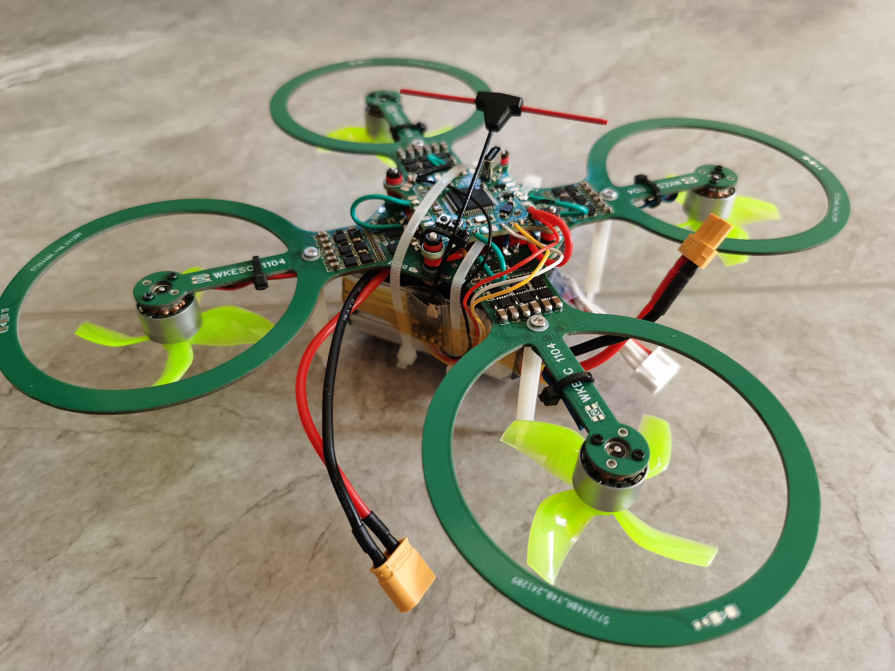
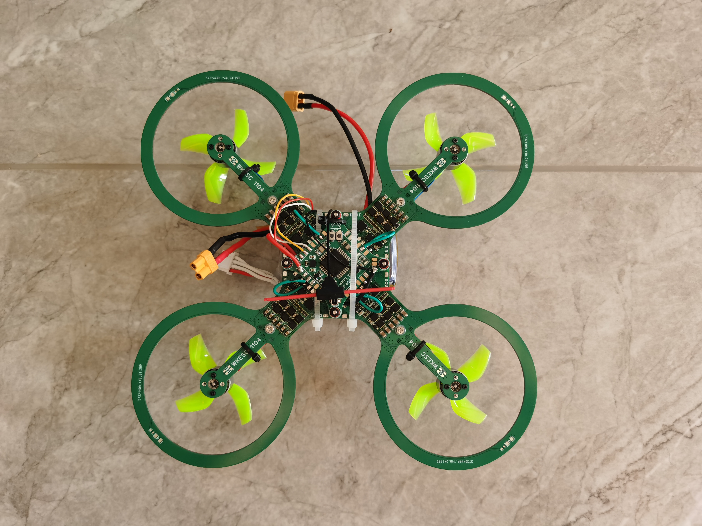

### F405 PCB FPV

PCB集成四旋翼飞行器    PCB Integrated Quadcopter

### 文件说明

**ESC**: 集成电调 BOM 原理图 Gerber等

**F405**: STM32F405微型飞控 BOM 原理图 Gerber等

**MAINBOARD**：机体主结构板 BOM 原理图 Gerber等

**Projects**: 立创EDA(专业版) PCB工程文件

**manual**: 元器件采购、全流程制作手册

### File Description

**ESC**: Electronic Speed Controller BOM (Bill of Materials), Schematic, Gerber files, etc.

**F405**: STM32F405 Mini Flight Controller BOM (Bill of Materials), Schematic, Gerber files, etc.

**MAINBOARD**: Mainboard BOM (Bill of Materials), Schematic, Gerber files, etc.

**Projects**: Lichuang EDA (Professional Version) PCB Engineering Files

**manual**: Component Procurement, Full Process Manufacturing Manual

